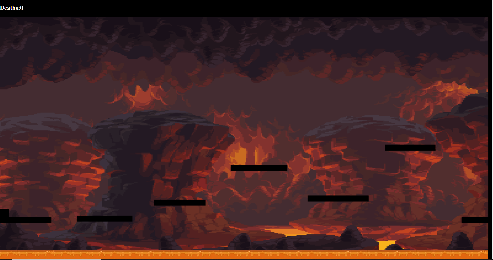
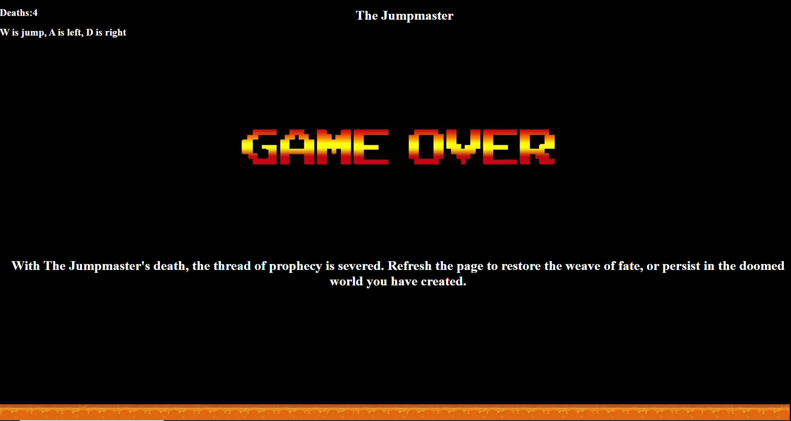
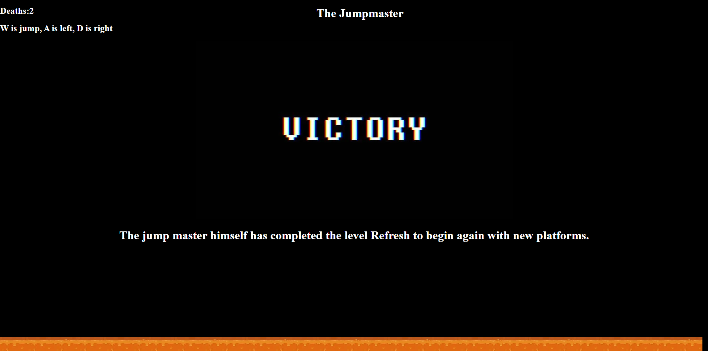
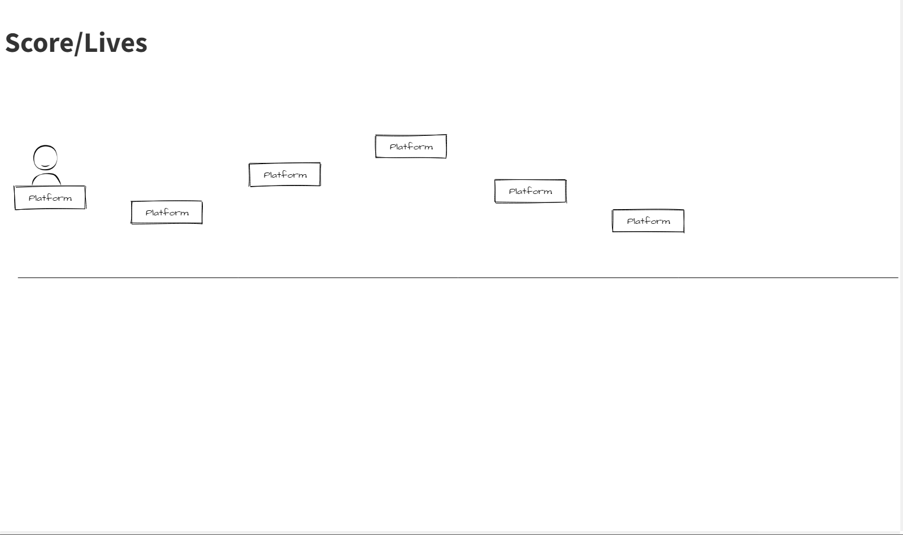

# The Jumpmaster

# A platformer

https://dmrf1999.github.io/Platformer-Project-1/

D is left. A is right, and W is jump
You can hold W to jump higher
Every time the page is refreshed the platforms will be different
If you fall 5 times, you get a game over and must refresh the page to play again
If you make it to the last platform you win

# Technolgies Used
This project is written in HTML, CSS, and vanilla JavaScript

# Problems
I don't have a start screen because it was conflicting with how the game ran and having a working victory and death screen.

Problems
I don't have a start screen because it was conflicting with how the game ran and having a working victory and death screen, I would like to get that working.  I would also like to switch my audio files over to the API Howler at some point.

# User Stories
As a player, I want to be able to move left, right, and down.

As a player, I want to be able to have a game over scenario

# User Stories
As a player, I want to be able to move left, right, and down.

As a player, I want to be able to have a game over scenario

As a player I would like to have a victory scenario

As a player I would like to have a victory scenario

# Stretch Goals
As a player I would like to be able to see my death count

As a player I would like to have a timer.

